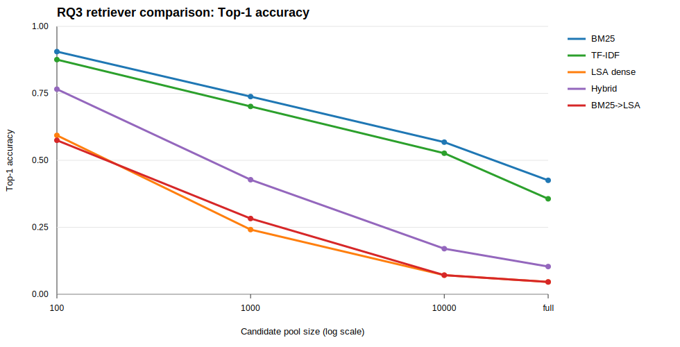

# RQ3 正式实验分析：不同 Retriever 在大规模 Skill Library 下的表现

**日期**：2026-07-09  
**研究问题**：RQ3 - How do different retrievers behave under large-scale skill libraries?  
**实验脚本**：`experiments/rq3_retriever_comparison.py`  
**输出目录**：`data/experiments/rq3_retriever_comparison/`

---

## 1. 结论摘要

RQ3 实验显示：**在当前 Skill-Usage 设置下，BM25 是最强的本地可复现 retriever，TF-IDF 次之；LSA dense proxy、BM25+LSA hybrid 和 BM25→LSA rerank 在大规模候选池下明显退化。**

Full library 下主要结果：

| Retriever | Top-1 | Hit@10 | MRR@10 | NDCG@10 |
|---|---:|---:|---:|---:|
| BM25 | 0.425 | 0.667 | 0.513 | 0.411 |
| TF-IDF | 0.356 | 0.655 | 0.461 | 0.376 |
| Hybrid BM25+LSA | 0.103 | 0.345 | 0.160 | 0.145 |
| LSA dense | 0.046 | 0.126 | 0.064 | 0.052 |
| BM25→LSA rerank | 0.046 | 0.218 | 0.089 | 0.086 |

因此，RQ3 的当前答案是：**在没有神经 embedding query encoder 的本地可复现实验里，传统 lexical retrievers 明显优于 LSA-style dense proxy。BM25 对大规模 skill retrieval 最稳。**

---

## 2. 实验设置

### 数据

- 数据集：Skill-Usage
- 任务数：87
- Skill library size：34,396
- Query 来源：`data/raw/Skill-Usage/data/task_queries.json`
- Gold skill 来源：`data/raw/Skill-Usage/data/task_skill_mapping.json`
- Skill text：`skill name + skill description`

### Candidate Pool

候选池大小：

| Pool size | Repeats |
|---:|---:|
| 100 | 5 |
| 1000 | 5 |
| 10000 | 5 |
| full | 1 |

每个 candidate pool 都强制包含该任务的 gold skills；非 full pool 使用 random distractors。

### Retrievers

| Retriever | Definition |
|---|---|
| `bm25` | Corpus-level BM25 over skill name + description |
| `tfidf` | Sparse TF-IDF cosine similarity |
| `lsa_dense` | Dense latent semantic analysis using TF-IDF + TruncatedSVD |
| `hybrid_bm25_lsa` | Reciprocal-rank fusion of BM25 and LSA |
| `bm25_lsa_rerank` | BM25 top-100 first stage, reranked by LSA score |

### Important Boundary

The official neural query embedding model `Qwen/Qwen3-Embedding-4B` was not available in the local cache, and the experiment did not download external models. Therefore:

- `lsa_dense` is a **local dense retrieval proxy**.
- It should **not** be interpreted as a true neural dense retriever such as BGE, E5, or Qwen embedding.
- RQ3 should be extended later with a cached or installable neural embedding model.

---

## 3. 主要结果



| Retriever | Pool size | Top-1 | Hit@10 | MRR@10 | NDCG@10 |
|---|---:|---:|---:|---:|---:|
| BM25 | 100 | 0.906 | 0.984 | 0.936 | 0.848 |
| BM25 | 1000 | 0.738 | 0.952 | 0.811 | 0.717 |
| BM25 | 10000 | 0.568 | 0.802 | 0.637 | 0.526 |
| BM25 | full | 0.425 | 0.667 | 0.513 | 0.411 |
| TF-IDF | 100 | 0.876 | 0.989 | 0.921 | 0.842 |
| TF-IDF | 1000 | 0.701 | 0.952 | 0.783 | 0.690 |
| TF-IDF | 10000 | 0.526 | 0.722 | 0.591 | 0.476 |
| TF-IDF | full | 0.356 | 0.655 | 0.461 | 0.376 |
| LSA dense | 100 | 0.593 | 0.929 | 0.718 | 0.675 |
| LSA dense | 1000 | 0.241 | 0.662 | 0.365 | 0.338 |
| LSA dense | 10000 | 0.071 | 0.322 | 0.128 | 0.124 |
| LSA dense | full | 0.046 | 0.126 | 0.064 | 0.052 |
| Hybrid BM25+LSA | 100 | 0.766 | 0.986 | 0.845 | 0.788 |
| Hybrid BM25+LSA | 1000 | 0.428 | 0.832 | 0.551 | 0.492 |
| Hybrid BM25+LSA | 10000 | 0.170 | 0.536 | 0.265 | 0.240 |
| Hybrid BM25+LSA | full | 0.103 | 0.345 | 0.160 | 0.145 |
| BM25→LSA rerank | 100 | 0.575 | 0.933 | 0.705 | 0.670 |
| BM25→LSA rerank | 1000 | 0.283 | 0.680 | 0.399 | 0.365 |
| BM25→LSA rerank | 10000 | 0.071 | 0.393 | 0.151 | 0.147 |
| BM25→LSA rerank | full | 0.046 | 0.218 | 0.089 | 0.086 |

---

## 4. Scaling Behavior

Top-1 drop from pool size 100 to full:

| Retriever | Top-1@100 | Top-1@full | Absolute drop | Full / 100 |
|---|---:|---:|---:|---:|
| BM25 | 0.906 | 0.425 | 0.480 | 0.470 |
| TF-IDF | 0.876 | 0.356 | 0.520 | 0.407 |
| Hybrid BM25+LSA | 0.766 | 0.103 | 0.662 | 0.135 |
| LSA dense | 0.593 | 0.046 | 0.547 | 0.078 |
| BM25→LSA rerank | 0.575 | 0.046 | 0.529 | 0.080 |

BM25 and TF-IDF degrade as the library grows, but they degrade much more gracefully than LSA-based methods. LSA-based methods lose most of their Top-1 accuracy under full-library retrieval.

---

## 5. Latency / Cost Notes

Local scoring time per query:

| Retriever | Build seconds | Score seconds / query |
|---|---:|---:|
| BM25 | 0.389 | 0.00031 |
| TF-IDF | 0.386 | 0.00190 |
| LSA dense | 0.716 | 0.00117 |
| Hybrid BM25+LSA | 1.105 | 0.00149 |
| BM25→LSA rerank | 1.105 | 0.00149 |

Hybrid and rerank reuse BM25 + LSA scores, so the reported scoring time is the combined BM25 + LSA query-scoring cost. Their extra cost in this script is mostly rank fusion or reranking over existing score arrays.

---

## 6. Interpretation

### 6.1 BM25 is a strong baseline

BM25 performs best across all tested pool sizes. This makes sense because Skill-Usage task queries and skill descriptions often share explicit technical terms, tool names, formats, or domain vocabulary.

### 6.2 TF-IDF is competitive but weaker

TF-IDF has similar behavior to BM25 but lower full-library Top-1. BM25's length normalization and term saturation appear useful for skill descriptions.

### 6.3 LSA dense proxy is not enough

LSA dense retrieval performs poorly at full scale. This does not mean neural dense retrieval will fail; it means this particular local dense proxy loses too much lexical precision and is not a substitute for BGE/E5/Qwen-style embeddings.

### 6.4 Hybrid can hurt if one component is weak

Hybrid BM25+LSA performs worse than BM25 alone because the LSA component contributes noisy high ranks. This is a useful warning: hybrid retrieval is not automatically better; the secondary retriever must be strong enough to help.

### 6.5 Reranking can hurt if the reranker is weak

BM25→LSA rerank performs much worse than BM25. The first stage often contains the gold skill, but the LSA reranker moves weaker semantic-proxy matches above it.

---

## 7. 当前限制

- This is not yet a true neural retriever comparison because the neural query embedding model was not locally cached.
- LSA dense is a local proxy, not a replacement for BGE/E5/Qwen embeddings.
- Current retrievers use only skill name + description, not full `SKILL.md`.
- Candidate pools use random distractors; RQ2-style hard distractors should be tested separately for retriever robustness.
- Latency measurements are local script-level measurements, not production serving benchmarks.

---

## 8. 下一步

1. Install or cache a smaller neural embedding model, such as BGE-small or E5-small, and rerun RQ3 with a true dense retriever.
2. Add a neural dense + BM25 hybrid condition.
3. Test retrievers under RQ2 hard distractor settings.
4. Add full `SKILL.md` content retrieval for BM25/TF-IDF and compare against name+description only.

---

## 9. Reproducibility

复现实验：

```bash
python3 experiments/rq3_retriever_comparison.py
```

主要输出：

- `data/experiments/rq3_retriever_comparison/summary.csv`
- `data/experiments/rq3_retriever_comparison/summary.json`
- `data/experiments/rq3_retriever_comparison/per_query_metrics.csv`
- `data/experiments/rq3_retriever_comparison/ranking_examples.json`
- `data/experiments/rq3_retriever_comparison/top1_by_retriever.svg`
