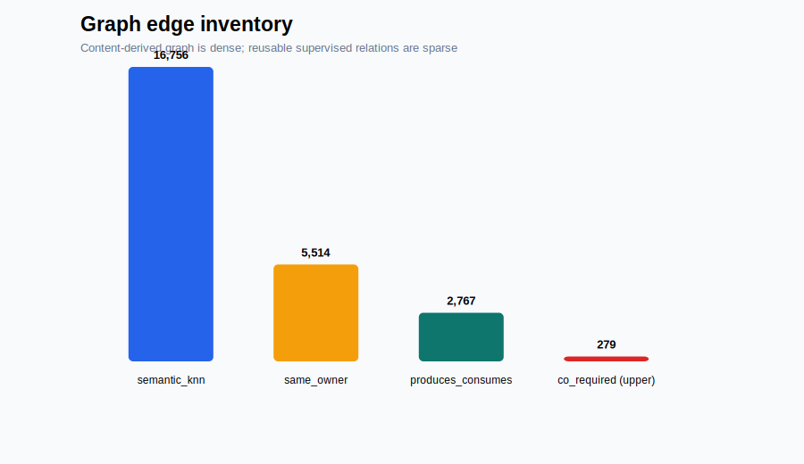
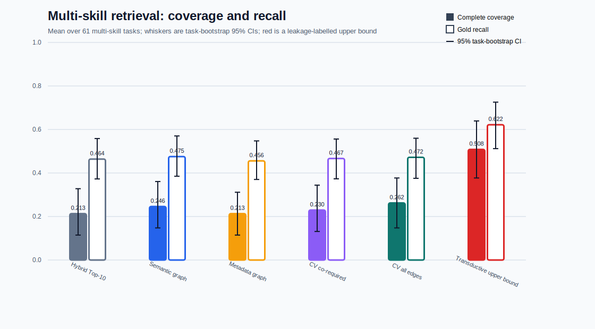
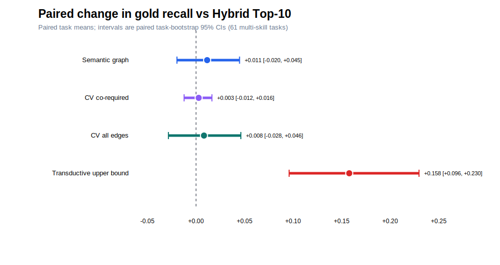

<!-- AUTO-GENERATED by question 8/scripts/generate_report.py. DO NOT EDIT NUMERIC RESULTS MANUALLY. -->

# Question 8：关系化 Skill Graph 能否改善大规模技能库中的检索与组合？

> **生成说明：**本报告由 `scripts/generate_report.py` 自动读取实验 CSV/JSON 生成。所有统计表、图引用、样本数、置信区间、案例数据和正文中的关键结果数值均来自脚本计算结果；如需修改实验，应重新运行脚本，而不是手工修改本文件。

## 摘要

本研究追问：当任务需要多个互补 skills 时，能否将 Markdown skill library 组织为关系图，从检索 seeds 出发补全 companion skills，并在固定上下文预算下减少无关 skill 暴露？实验保留全部 `87` 个任务，其中 `61` 个 multi-skill tasks 作为主分析；候选技能库从 `34,396` 缩减为 `5,000` 个 hard candidates。正式协议是 `5`-fold held-out task evaluation，每折只允许使用训练 tasks 建立 `co_required` 边。

在 multi-skill tasks 上，Hybrid Top-10 的完整覆盖率为 `0.213`，gold recall 为 `0.464`。完整覆盖率最高的防泄漏方法是 `CV all edges`，分别达到 `0.262` 和 `0.472`。相对 Hybrid 的 recall 配对差为 `+0.008`，95% CI 为 `[-0.028, +0.046]`。由于区间包含 0，不能宣称存在稳定的平均 recall 提升。Transductive upper bound 达到 `0.508` 完整覆盖率和 `0.622` recall，但它使用测试 gold relations，只用于表示潜力上界。

## 1. 与 RQ1–RQ4 的关系

- RQ1：大技能库带来 retrieval competition；
- RQ2：hard negatives 比随机噪声更危险；
- RQ3：Hybrid 能缓解但不能消除检索退化；
- RQ4：Top-1 correct 不等于 multi-skill downstream-ready；
- Question 8：检查结构化关系能否在固定 Top-10 budget 下补全技能集合。

## 2. 文献与方法依据

SkillsBench、SkillRet 与 SRA-Bench 支持“大规模 skill retrieval 和 focused exposure 是独立系统问题”；GraphRAG、HippoRAG 与 Multi-Hop Dense Retrieval 支持从局部 seeds 进行结构化或多跳扩展；RRF 用于构建强 Hybrid baseline；item-based collaborative filtering 为训练任务中的 skill co-occurrence 提供经典依据。已核验文献与 BibTeX 位于 `references/`。

## 3. 数据集与缩减规则

### 3.1 数据量

| Item | Value |
|---|---:|
| All tasks | 87 |
| Multi-skill tasks | 61 |
| Single-skill tasks | 26 |
| Unique gold skills | 198 |
| Gold assignments | 229 |
| Full library | 34,396 |
| Reduced library | 5,000 |

### 3.2 Gold skills per task

| Gold count | Task count |
|---:|---:|
| 1 | 26 |
| 2 | 20 |
| 3 | 18 |
| 4 | 12 |
| 5 | 6 |
| 6 | 4 |
| 7 | 1 |

### 3.3 Candidate library composition

| Source | Count | Role |
|---|---:|---|
| Gold union | 198 | 保证所有任务 gold 可检索 |
| BM25 hard negatives | 1994 | 词汇匹配干扰项 |
| MiniLM dense hard negatives | 1452 | 语义近邻干扰项 |
| Random fill | 1356 | 固定随机背景噪声 |
| Total | 5000 | Question 8 reduced library |

所有 `198` 个 gold skills 均被保留。Hard negatives 由实验脚本计算 BM25 与 MiniLM 排名后选择，随机补充使用 seed `6002`。

## 4. 图构建

| Edge type | Construction | Gold use | Count |
|---|---|---|---:|
| semantic_knn | MiniLM Top-k cosine neighbors | No | 16,756 |
| same_owner | 同 owner 内有限近邻 | No | 5,514 |
| produces_consumes | Artifact + input/output rules | No | 2,767 |
| CV co_required | Only training tasks in each fold | Train labels only | 199–237 per fold |
| Transductive co_required | All task gold pairs | Contains test labels | 279 |

Gold relation sparsity 是本实验的关键约束：`186/198` 个 gold skills 只出现一次；`7/279` 个 co-required pairs 在多个任务中重复。各折 test gold skills 在训练 tasks 中出现的平均比例范围为 `0.172–0.286`。



**图 1 自动数据来源：**`graph_stats.json → content_edge_counts/transductive_corequired_edges`。本图仅描述边记录数量，不作为 retrieval performance 证据。SVG 由 `scripts/analyze_results.py` 生成。

## 5. Retrieval 与 graph scoring

Baseline 使用 BM25 description scores 与 MiniLM dense scores，经 Reciprocal Rank Fusion 形成 Hybrid ranking。图方法取 Top-3 或 Top-5 seeds，并在 Top-30 retrieval candidates 与一跳邻居中计算：

```text
score(skill) = retrieval_rank_score(skill)
             + beta × Σ edge_type_weight × edge_weight(seed, skill)
```

固定参数：Top-10 budget、`beta=0.35`、semantic k=`8`、threshold=`0.52`、folds=`5`、seed=`6002`。

## 6. 统计协议

主分析单位是 `61` 个 multi-skill tasks。`complete_gold_coverage` 是每任务 0/1 指标；`gold_recall` 是命中 gold 数除以 gold 总数；`skill_precision` 是 Top-10 中 gold 比例。均值 CI 来自 2,000 次 task-level bootstrap；方法比较使用同一任务上的配对差值 bootstrap。CI 表示跨任务不确定性，不是模型 API confidence，也不是 repeat-run variance。

## 7. 正式结果

### 7.1 Multi-skill main results

| Method | Complete | Complete 95% CI | Recall | Recall 95% CI | Precision | Extra | Approx tokens |
|---|---:|---:|---:|---:|---:|---:|---:|
| Hybrid Top-10 | 0.213 | [0.115, 0.328] | 0.464 | [0.373, 0.558] | 0.151 | 8.492 | 21,410.8 |
| Semantic graph | 0.246 | [0.148, 0.361] | 0.475 | [0.385, 0.570] | 0.156 | 8.443 | 21,287.1 |
| Metadata graph | 0.213 | [0.115, 0.311] | 0.456 | [0.370, 0.548] | 0.149 | 8.508 | 21,539.8 |
| CV co-required | 0.230 | [0.131, 0.344] | 0.467 | [0.373, 0.556] | 0.152 | 8.475 | 20,956.4 |
| CV all edges | 0.262 | [0.148, 0.377] | 0.472 | [0.376, 0.560] | 0.156 | 8.443 | 21,551.5 |
| Transductive upper bound | 0.508 | [0.377, 0.639] | 0.622 | [0.512, 0.726] | 0.213 | 7.869 | 21,189.9 |



**图 2 自动数据来源：**`summary.csv` 中 `scope=multi_skill_only, n_tasks=61`。柱高是任务均值，误差线是 2,000 次 task-bootstrap 95% CI。SVG 由 `scripts/analyze_results.py` 生成。

### 7.2 Paired differences vs Hybrid

| Method | Δ complete | Δ recall | Δ recall 95% CI | Recall W/T/L |
|---|---:|---:|---:|---:|
| Semantic graph | +0.033 | +0.011 | [-0.020, +0.045] | 6 / 52 / 3 |
| CV co-required | +0.016 | +0.003 | [-0.012, +0.016] | 2 / 58 / 1 |
| CV all edges | +0.049 | +0.008 | [-0.028, +0.046] | 7 / 50 / 4 |
| Transductive upper bound | +0.295 | +0.158 | [+0.096, +0.230] | 24 / 35 / 2 |



**图 4 自动数据来源：**`paired_comparisons.csv`；每个点为同一批 `61` 个任务上的 `method - hybrid_top10` 配对均值，区间为配对 task-bootstrap 95% CI，零线表示无变化。

所有 leakage-free graph methods 的 recall CI 均包含 0；因此正式结论是“未观察到稳定平均 recall 改善”。Transductive upper bound 的区间高于 0，但其测试标签泄漏使其不能作为泛化成绩。

### 7.3 All-task descriptive results

| Method | Complete | Recall | Precision |
|---|---:|---:|---:|
| Hybrid Top-10 | 0.333 | 0.509 | 0.124 |
| Semantic graph | 0.356 | 0.517 | 0.128 |
| Metadata graph | 0.333 | 0.503 | 0.123 |
| CV co-required | 0.345 | 0.511 | 0.125 |
| CV all edges | 0.368 | 0.515 | 0.128 |
| Transductive upper bound | 0.540 | 0.620 | 0.168 |

该表包含 single-skill tasks，仅用于完整性检查。关于 skill composition 的结论以 multi-skill table 为准。

## 8. Conclusion

在当前 `5,000`-skill reduced hard pool 与 held-out protocol 下，关系图只能带来小幅、任务依赖且统计上不稳定的改善，尚不能证明普遍优于 Hybrid Top-10。明显更高的 transductive upper bound 表明关系图具有潜力，但潜力依赖可复用、无泄漏的 procedural relations。仅用稀疏 task–gold co-occurrence 或宽泛 semantic/metadata neighbors，容易把 graph expansion 变成另一种近邻噪声。

## 9. Limitations

1. Reduced pool 不是完整 `34,396` library；
2. 数据只有 `87` 个 tasks，且 gold relations 稀疏；
3. produces–consumes edges 是规则抽取；
4. Semantic graph 与 dense baseline 共享 MiniLM representation；
5. Tokens 使用 `ceil(character_count / 4) over name + description + full SKILL.md`；
6. 未重新调用 Solver/Judge 验证 downstream pass rate；
7. Transductive upper bound 包含测试 labels，严禁作为正式泛化结果引用。

## 10. Reproducibility and audit trail

- Raw task observations: `results/per_task_results.csv`
- Frozen summary + CI: `results/summary.csv`
- Paired statistics: `results/paired_comparisons.csv`
- Graph statistics: `results/graph_stats.json`
- Case studies: `results/case_studies.json`
- Generated figures: `results/figures/*.svg`
- Figure field dictionary: `results/figure_data_dictionary.md`
- Generated tables only: `report/generated_result_tables.md`
- Figure generator: `scripts/analyze_results.py`
- Report generator: `scripts/generate_report.py`
